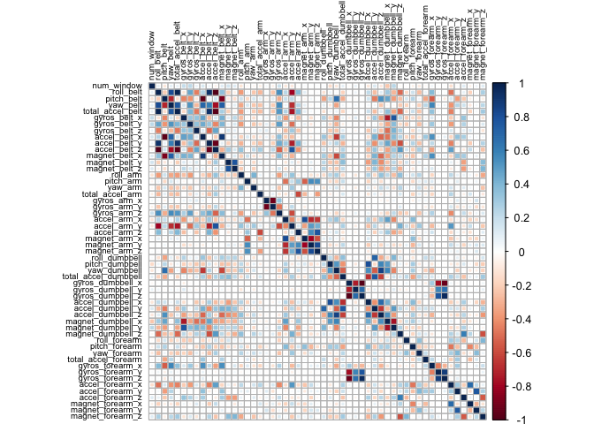
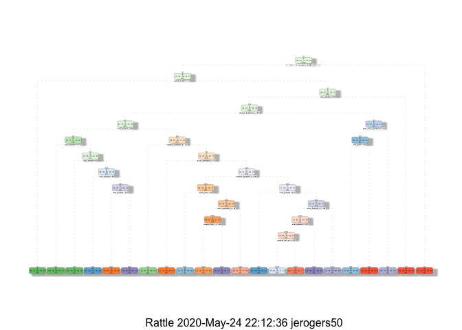

# Assignment

You should create a report describing how you built your model, how you used cross validation, what you think the expected out of sample error is, and why you made the choices you did. You will also use your prediction model to predict 20 different test cases.

# Background

Using devices such as Jawbone Up, Nike FuelBand, and Fitbit it is now possible to collect a large amount of data about personal activity relatively inexpensively. These type of devices are part of the quantified self movement – a group of enthusiasts who take measurements about themselves regularly to improve their health, to find patterns in their behavior, or because they are tech geeks. One thing that people regularly do is quantify how much of a particular activity they do, but they rarely quantify how well they do it. In this project, your goal will be to use data from accelerometers on the belt, forearm, arm, and dumbell of 6 participants. They were asked to perform barbell lifts correctly and incorrectly in 5 different ways. More information is available from the website here: http://web.archive.org/web/20161224072740/http:/groupware.les.inf.puc-rio.br/har (see the section on the Weight Lifting Exercise Dataset).

# Data Importing and Cleaning


```r
# Load packages
library(caret) #version 6.0-86
```

```
## Loading required package: lattice
```

```
## Loading required package: ggplot2
```

```r
library(rpart) #version 4.1-15
library(corrplot) #version 0.84
```

```
## corrplot 0.84 loaded
```

```r
library(rattle) #version 5.3.0
```

```
## Rattle: A free graphical interface for data science with R.
## Version 5.3.0 Copyright (c) 2006-2018 Togaware Pty Ltd.
## Type 'rattle()' to shake, rattle, and roll your data.
```

```r
# Download training data for this project
getwd()

download.file("https://d396qusza40orc.cloudfront.net/predmachlearn/pml-training.csv", "pml_training.csv")
download.file("https://d396qusza40orc.cloudfront.net/predmachlearn/pml-testing.csv", "pml_testing.csv")

# The data for this project come from this source: http://web.archive.org/web/20161224072740/http:/groupware.les.inf.puc-rio.br/har. If you use the document you create for this class for any purpose please cite them as they have been very generous in allowing their data to be used for this kind of assignment.

# Read the activity data file 
training_data <- read.csv("pml_training.csv")
testing_data <- read.csv("pml_testing.csv")
head(training_data)
head(testing_data)

# Create a partition using the caret package with the training dataset on 70,30 ratio
train_variable <- createDataPartition(training_data$classe, p = 0.7, list = FALSE)
train <- training_data[train_variable, ]
test <- training_data[-train_variable, ]
dim(train)
dim(test)

# Remove variables with nearly zero variance
near_zero_variable <- nearZeroVar(train)
train <- train[, -near_zero_variable]
test  <- test[, -near_zero_variable]
dim(train)
dim(test)

# Remove variables with mostly NA observations
NA_variable    <- sapply(train, function(x) mean(is.na(x))) > 0.95
train <- train[, NA_variable==FALSE]
test  <- test[, NA_variable==FALSE]
dim(train)
dim(test)

head(train)
head(test)

# Remove identification / non-numerical variables
train <- train[, -(1:5)]
test  <- test[, -(1:5)]

head(train)
head(test)
```

# Correlation Analysis

Based on the plot below, it can be determined that there is little correlation across the variables. 


```r
ncol(train)
```

```
## [1] 54
```

```r
cor_matrix <- cor(train[, -ncol(train)])
corrplot(cor_matrix, method = "color", type = "upper", tl.cex = .6, tl.col = rgb(0, 0, 0))
```

<!-- -->

# Prediction Models

For the purpose of this analysis I developed Random Forest and Decision Tree predictive models. These models were used to determine which of the two would yield more accurate predictions on the testing dataset. 


```r
set.seed(1800)
# Create Decision Tree model
model_fit_dt <- rpart(classe ~ ., data=train, method="class")
fancyRpartPlot(model_fit_dt)
```

<!-- -->

```r
# Apply Decision Tree prediction on test dataset to determine accuracy
predict_decision_tree <- predict(model_fit_dt, newdata=test, type="class")
confusion_matrix_dt <- confusionMatrix(predict_decision_tree, test$classe)
confusion_matrix_dt
```

```
## Confusion Matrix and Statistics
## 
##           Reference
## Prediction    A    B    C    D    E
##          A 1479  148   37   46   13
##          B   96  751  127   80   63
##          C   27   98  835  134   35
##          D   59  108   21  636   82
##          E   13   34    6   68  889
## 
## Overall Statistics
##                                           
##                Accuracy : 0.7799          
##                  95% CI : (0.7691, 0.7905)
##     No Information Rate : 0.2845          
##     P-Value [Acc > NIR] : < 2.2e-16       
##                                           
##                   Kappa : 0.7214          
##                                           
##  Mcnemar's Test P-Value : < 2.2e-16       
## 
## Statistics by Class:
## 
##                      Class: A Class: B Class: C Class: D Class: E
## Sensitivity            0.8835   0.6594   0.8138   0.6598   0.8216
## Specificity            0.9421   0.9229   0.9395   0.9451   0.9748
## Pos Pred Value         0.8584   0.6723   0.7396   0.7020   0.8802
## Neg Pred Value         0.9531   0.9186   0.9598   0.9341   0.9604
## Prevalence             0.2845   0.1935   0.1743   0.1638   0.1839
## Detection Rate         0.2513   0.1276   0.1419   0.1081   0.1511
## Detection Prevalence   0.2928   0.1898   0.1918   0.1540   0.1716
## Balanced Accuracy      0.9128   0.7911   0.8767   0.8024   0.8982
```


```r
set.seed(1800)
# Create Random Forest model
control_random_forest <- trainControl(method="cv", number=3, verboseIter=FALSE)
model_fit_rf <- train(classe ~ ., data=train, method="rf", trControl=control_random_forest)
model_fit_rf$finalModel
```

```
## 
## Call:
##  randomForest(x = x, y = y, mtry = param$mtry) 
##                Type of random forest: classification
##                      Number of trees: 500
## No. of variables tried at each split: 27
## 
##         OOB estimate of  error rate: 0.18%
## Confusion matrix:
##      A    B    C    D    E  class.error
## A 3904    1    0    0    1 0.0005120328
## B    8 2649    1    0    0 0.0033860045
## C    0    5 2391    0    0 0.0020868114
## D    0    0    7 2244    1 0.0035523979
## E    0    0    0    1 2524 0.0003960396
```

```r
# Apply Randowm Forest prediction on test dataset to determine accuracy
predict_random_forest <- predict(model_fit_rf, newdata=test)
confusion_matrix_rf <- confusionMatrix(predict_random_forest, test$classe)
confusion_matrix_rf
```

```
## Confusion Matrix and Statistics
## 
##           Reference
## Prediction    A    B    C    D    E
##          A 1674    2    0    0    0
##          B    0 1135    2    0    0
##          C    0    1 1024   13    0
##          D    0    1    0  950    1
##          E    0    0    0    1 1081
## 
## Overall Statistics
##                                           
##                Accuracy : 0.9964          
##                  95% CI : (0.9946, 0.9978)
##     No Information Rate : 0.2845          
##     P-Value [Acc > NIR] : < 2.2e-16       
##                                           
##                   Kappa : 0.9955          
##                                           
##  Mcnemar's Test P-Value : NA              
## 
## Statistics by Class:
## 
##                      Class: A Class: B Class: C Class: D Class: E
## Sensitivity            1.0000   0.9965   0.9981   0.9855   0.9991
## Specificity            0.9995   0.9996   0.9971   0.9996   0.9998
## Pos Pred Value         0.9988   0.9982   0.9865   0.9979   0.9991
## Neg Pred Value         1.0000   0.9992   0.9996   0.9972   0.9998
## Prevalence             0.2845   0.1935   0.1743   0.1638   0.1839
## Detection Rate         0.2845   0.1929   0.1740   0.1614   0.1837
## Detection Prevalence   0.2848   0.1932   0.1764   0.1618   0.1839
## Balanced Accuracy      0.9998   0.9980   0.9976   0.9925   0.9994
```

After comparing results from both models, the random forest model will be used for prediction on the testing dataset. With an accuracy of ~99% and an out of bounds error percentage or ~0.2% this is the best model to use. The accuracy of the decision tree was significantly lower.

# Predicting with the Testing Data


```r
# Apply random forest predictor to testing dataset
predict_final <- predict(model_fit_rf, newdata=testing_data)
predict_final
```

```
##  [1] B A B A A E D B A A B C B A E E A B B B
## Levels: A B C D E
```
